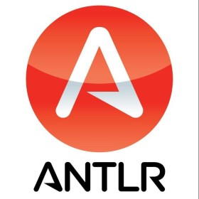

# MONTy Python Interpreter

Este é um interpretador para a linguagem de programação MONTy Python, utilizando ANTLR4 para gerar a análise léxica e sintática.

## Pré-requisitos

Antes de começar, certifique-se de ter o ANTLR4 e Python 3 instalados no seu sistema.

## Configuração

Para gerar os analisadores léxico e sintático, siga os seguintes passos:

1. Navegue até o diretório que contém o arquivo `MONTyPython.g4`.
2. Execute o seguinte comando:

   ```shell
   antlr4 MONTyPython.g4 -Dlanguage=Python3 -visitor

Após executar o comando, os arquivos MONTyPythonLexer.py, MONTyPythonParser.py, e MONTyPythonVisitor.py serão gerados.

Para executar um programa MONTy Python sem erros:

python3 parse_monty.py example.mtp
Este comando analisa o arquivo example.mtp, que deve ser um programa MONTy Python válido, e executa o código, mostrando a saída do programa no terminal.
Para executar um programa MONTy Python com erros intencionais:

python3 parse_monty.py example_error.mtp


<h1 align="center">
    
</h1>

<p align="center">
ANTLR com Python
</p>

<h1 align="center">
MONTy Python Interpreter
</h1>

<p align="center">
# TESTE com ANTLR e Python
</p>

📌 ANTLR com Python: Interpretação da Linguagem MONTy Python
------------------
Este guia descreve como criar, analisar e visualizar uma árvore de análise para a linguagem de programação MONTy Python, utilizando ANTLR para gerar os analisadores e Python para executar a interpretação.

Este guia passo a passo descreve como processar programas escritos em MONTy Python usando ANTLR para gerar o analisador em Python, interpretando e visualizando potencialmente a árvore de análise sintática.

## Pré-requisitos

- Java (para executar o ANTLR).
- ANTLR4 (baixe `antlr-4.x-complete.jar` do [site oficial do ANTLR](https://www.antlr.org/)).
- Python 3.

## Passo a Passo

### 1. Criar a Gramática ANTLR para MONTy Python

Definimos a gramática no arquivo `MONTyPython.g4`.

### 2. Gerar os Ficheiros Python com ANTLR

Para gerar os analisadores léxico e sintático, siga os seguintes passos:

1. Navegue até o diretório que contém o arquivo `MONTyPython.g4`.
2. Execute o seguinte comando:

   ```shell
   antlr4 MONTyPython.g4 -Dlanguage=Python3 -visitor

### 3. Preparar o Ambiente Python

Certifique-se de que Python 3 está instalado.

### 4. Escrever e executar o Script de Teste em Python

Executamos os seguintes comandos para testar a interpretação de programas MONTy Python:

<pre> python3 parse_monty.py example.mtp </pre>
<pre> python3 parse_monty.py example_error.mtp </pre>


🔧 Tecnologias utilizadas:
------------------

- Python
- ANTLR 
- VS Code

💬 Fale comigo
------------------
[*Entre em contato comigo*](https://www.linkedin.com/in/ivo-baptista-3712144/)
